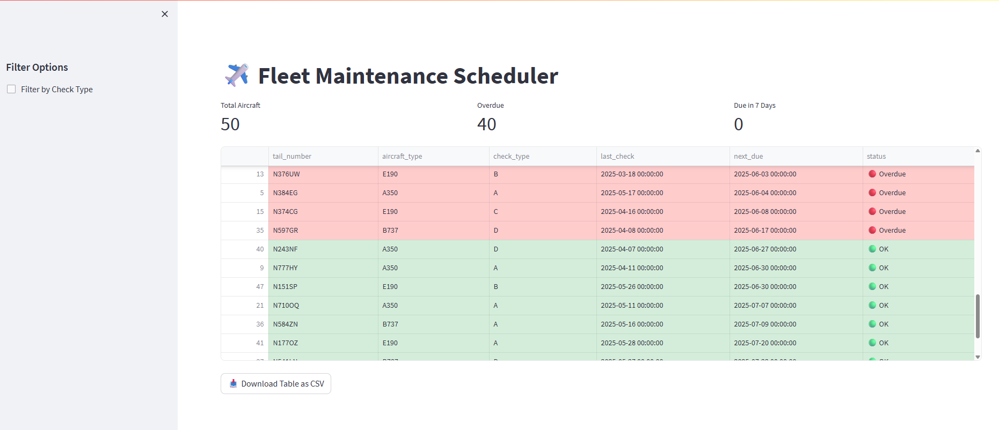

# ✈️ Fleet Maintenance Scheduler

An interactive dashboard to monitor aircraft maintenance status by tail number, check type, and due dates. Built using **Python**, **Streamlit**, and **Pandas**, this app allows users to identify overdue aircraft, view upcoming scheduled checks, and export filtered maintenance data.



---

## 📊 Features

- View maintenance status for a fleet of aircraft
- Automatic detection of:
  - ✅ OK
  - 🟠 Due within 7 days
  - 🔴 Overdue checks
- Filter by check type (A/B/C/D)
- Color-coded row highlighting for clear prioritization
- Summary metrics (total aircraft, overdue, due soon)
- Export filtered data to CSV with a single click

---

## 🧰 Tech Stack

- [Streamlit](https://streamlit.io/)
- [Pandas](https://pandas.pydata.org/)
- [Python 3.9+](https://www.python.org/)
- CSV for mock fleet data

---

## 🚀 Getting Started

### 1. Clone the Repository

```bash
git clone https://github.com/PFZM/fleet-maintenance-scheduler.git
cd fleet-maintenance-scheduler
```

### 2. Set Up a Virtual Environment

```bash
python -m venv venv
venv\Scripts\activate  # On Windows
pip install -r requirements.txt
```

### 3. Run the App

```bash
streamlit run app.py
```

The app will launch in your browser at `http://localhost:8501`.

---

## 📂 Project Structure

```
fleet-maintenance-scheduler/
├── app.py
├── data/
│   └── fleet_status.csv
├── requirements.txt
├── .gitignore
├── assets/
│   └── screenshot.png
└── README.md
```

---

## 📦 Sample Dataset

The app uses mock aviation data with the following fields:

- `tail_number` — aircraft ID
- `aircraft_type` — model (e.g., A320, B737)
- `check_type` — A, B, C, or D checks
- `last_check` — date of last inspection
- `days_until_due` — when the next check is due

---

## 🛣️ Roadmap / Potential Enhancements

- [ ] Add check history per aircraft
- [ ] Calendar heatmap of maintenance events
- [ ] Integration with OpenSky API for aircraft metadata
- [ ] Role-based access (e.g., maintenance planner vs mechanic view)

---

## 👤 Author

**Pablo Zambrano**  
Cloud & Data Engineer pivoting into aviation tech 🚀  
[LinkedIn →](https://www.linkedin.com/in/pablo-zambrano)

---

## 📄 License

This project is licensed under the [MIT License](LICENSE).
